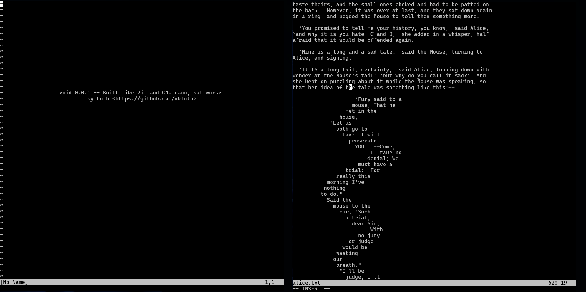

**void** is a stupid, free and open-source, terminal-based text editor program
built based on Salvatore Sanfilippo's (aka antirez) kilo text editor at its
core with the help of Paige Ruten (aka snaptoken) Build Your Own Text Editor
booklet. Unlike the original kilo editor, void made use of ncurses programming
library instead of plain escape sequences manipulation and termios.h functions.

I wrote this text editor back in 2023 because I'm bored and curious of how
terminal-based text editors like Vim and GNU Nano works and still maintaining it
to this day. I won't say I made this editor for daily use in mind, it primarily
made just for fun anyway. For now, void is extremely bare bone and pretty much
**useless** and outdated by today's standard (but I don't care and I acknowledge
that so I'm well aware of this).

Here's the installation steps if you're interested of trying or contributing
(I'll update this README later on by including the text editor features
cause I'm quite busy at the moment):

## Installation

To install void, you'll need to **build it from source** yourself. I didn't
provide any compiled binary here unfortunately for now. Here's the tools needed
to start:

```
gcc >= 12.2.0
make >= 4.3
ncurses >= 6.4-4
```

For Windows users, this editor unfortunately is not designed natively for your
OS. You have to make use of WSL instead. I'm not really sure for macOS though, I
never tried one before. Fun fact, it's possible for you to build this project
through Termux and yes, I tried it. It works.

### Building from source

```
git clone https://github.com/mkluth/void.git
cd void
make
```

The binary will placed in the current directory and can be moved to anywhere you
like. There are two more `make` command options worth knowing for this project:

```
make debug # Compiling for debugging purposes.
make clean # Clear the void directory from *.o files and its compiled binary
```

For debugging, it's totally up to you to either use `gdb`, `lldb` or even
`valgrind`. Same thing applied for compiling with LLVM `clang`, it's totally up
to you (but you'll need to edit the provided `Makefile` if you're interested of
automating the entire compilation process -- it uses `gcc` by default).

## Documentation

Currently in progress, it'll be here in the future. Just be patience ;)
For the code style guide, please follow the Linux kernel style guide because
that's my most favourite style guide for C in particular.

## Contributing

If you happened to find any bugs or even interested of submitting pull requests,
I'll be more than happy to listen to your feedbacks and working together with
you! Sorry for any grammatical errors you found anywhere in this project, I'm
not a native English speaker.
